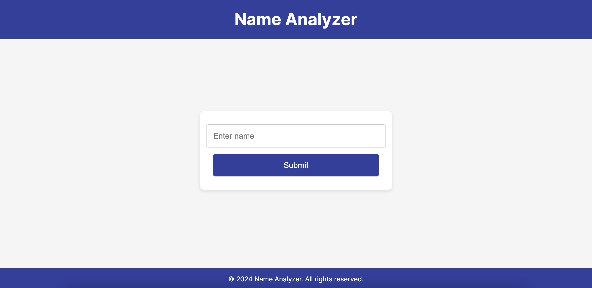
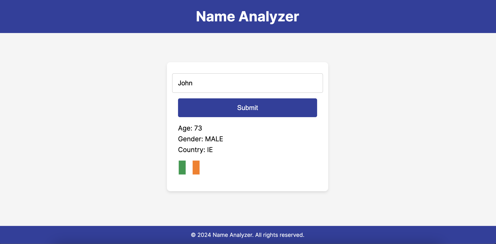

# Name Analyzer

Name Analyzer is a simple web application built with Next.js that analyzes a person's name to guess their age, gender, and country using public APIs.

## Features

- Input a name and get the estimated age, gender, and country.
- Beautiful and responsive UI design.
- Real-time loading indicator and error handling.
- Developed using Next.js framework.

## Technologies Used

- Next.js
- React
- CSS Modules

## APIs Used

- [Agify](https://api.agify.io)
- [Genderize](https://api.genderize.io)
- [Nationalize](https://api.nationalize.io)
- [Flagsapi](https://flagsapi.com/)

## Deployment

This project is deployed and accessible at [Name Analyzer](https://name-analyzer-olive.vercel.app/).

## Getting Started

To run this project locally, follow these steps:

1. Clone this repository.
2. Install dependencies using `npm install`.
3. Run the development server using `npm run dev`.
4. Open [http://localhost:3000](http://localhost:3000) in your browser.

## Screenshots

## License

This project is licensed under the MIT License - see the [LICENSE](./LICENSE) file for details.
